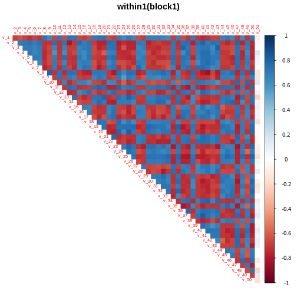
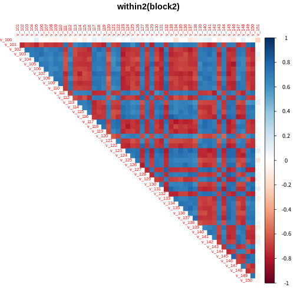
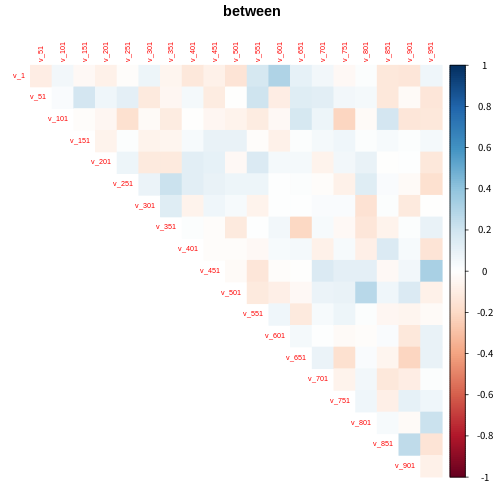
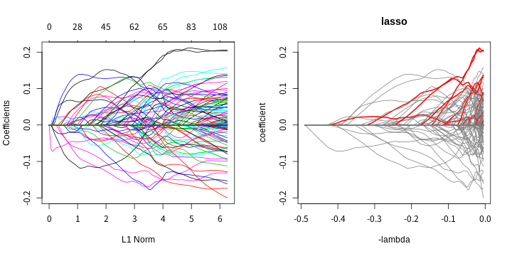
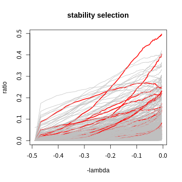

### 1. 시뮬레이션 데이터 세팅
<br>  

##### n : 100, p : 1000 (high dimensional data)
##### 유의한 변수 갯수 : 50개 (block당 1개, sparsity solution)
##### block : 20개
##### multicollinearity : 약 0.9 (각 block내에서)
##### high noise, high multicollinearity
<br>  
<br>  

#### 1.1 block내 데이터 상관성


<br>  
<br>  

#### 1.2 block간 데이터 상관성

<br>  
<br>  

#### 1.3 x, y 관계

```r
idx_true <- seq(1, p, by = p/block) # block당 하나
b <- c(
  1.6, 2.9, 1.9, 2.9, 2.8, 2, 2.4, 2.3, 1.5, 2.9,
  2.4, 2.2, 2, 2.4, 2.3, 2.4, 2.8, 2.2, 2.5, 2.2
)
y <- y_generator(
  x = x, n_true = block, b = b, noise_signal = 0.5, # low random error
  idx_true = idx_true, seed = 1
)

true_model <- lm(y ~ x[, idx_true])
summary(true_model)
```

```
## 
## Call:
## lm(formula = y ~ x[, idx_true])
## 
## Residuals:
##     Min      1Q  Median      3Q     Max 
## -0.9209 -0.2476  0.0128  0.2766  1.0526 
## 
## Coefficients:
##                 Estimate Std. Error t value Pr(>|t|)    
## (Intercept)      0.05444    0.04613   1.180 0.241464    
## x[, idx_true]1   0.21065    0.05255   4.008 0.000138 ***
## x[, idx_true]2   0.28497    0.05234   5.445 5.68e-07 ***
## x[, idx_true]3   0.20900    0.05198   4.021 0.000132 ***
## x[, idx_true]4   0.23283    0.04852   4.798 7.42e-06 ***
## x[, idx_true]5   0.24260    0.05016   4.837 6.41e-06 ***
## x[, idx_true]6   0.16722    0.05350   3.126 0.002483 ** 
## x[, idx_true]7   0.29861    0.04957   6.024 5.10e-08 ***
## x[, idx_true]8   0.17823    0.05209   3.421 0.000989 ***
## x[, idx_true]9   0.14165    0.04897   2.892 0.004937 ** 
## x[, idx_true]10  0.31503    0.05416   5.816 1.22e-07 ***
## x[, idx_true]11  0.26890    0.05180   5.191 1.58e-06 ***
## x[, idx_true]12  0.28141    0.05134   5.482 4.88e-07 ***
## x[, idx_true]13  0.17956    0.05011   3.583 0.000585 ***
## x[, idx_true]14  0.21928    0.05201   4.216 6.57e-05 ***
## x[, idx_true]15  0.14388    0.04936   2.915 0.004626 ** 
## x[, idx_true]16  0.18361    0.04984   3.684 0.000419 ***
## x[, idx_true]17  0.29735    0.05331   5.578 3.29e-07 ***
## x[, idx_true]18  0.19424    0.05242   3.706 0.000390 ***
## x[, idx_true]19  0.28698    0.05183   5.537 3.89e-07 ***
## x[, idx_true]20  0.15943    0.05673   2.810 0.006239 ** 
## ---
## Signif. codes:  0 '***' 0.001 '**' 0.01 '*' 0.05 '.' 0.1 ' ' 1
## 
## Residual standard error: 0.4613 on 79 degrees of freedom
## Multiple R-squared:  0.8731,	Adjusted R-squared:  0.841 
## F-statistic: 27.19 on 20 and 79 DF,  p-value: < 2.2e-16
```
<br>  
<br>  

### 2. 모델 결과
#### 2.1 lasso

<br>  
<br>  

#### 2.2 stability selection
<br>  


